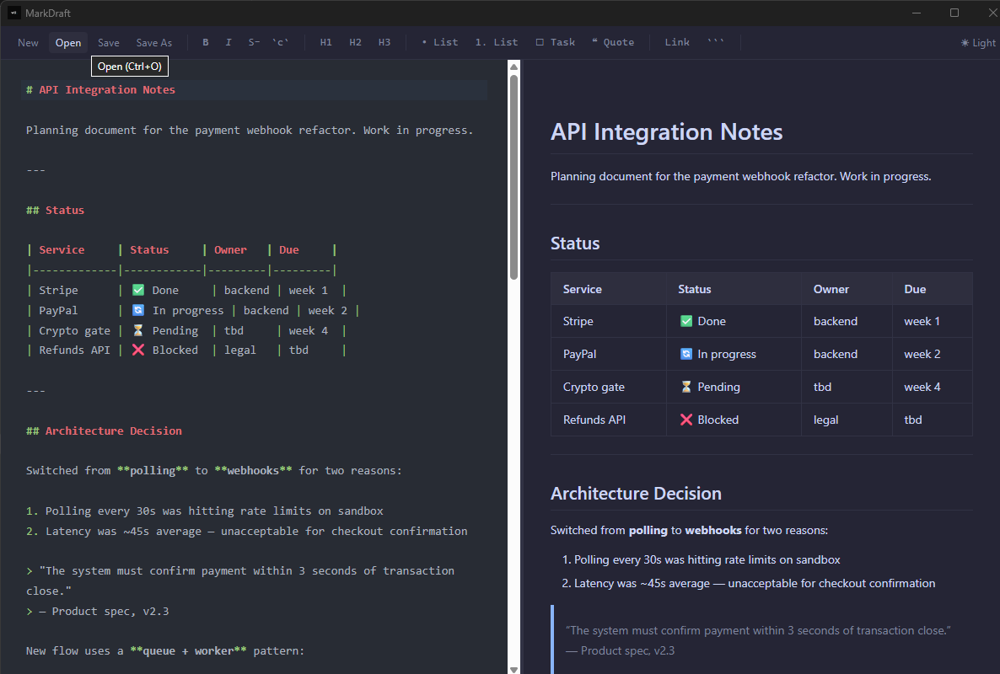

# MarkDraft

Minimalist local Markdown editor. Open, write, preview, save `.md` files — no cloud, no subscriptions, no AI.

**Stack:** Tauri 2 + SolidJS + CodeMirror 6 + markdown-it



---

## Install (unsigned binaries)

> v0.1.0 is **Windows only**. macOS build is planned for a future release.
> Binaries are not code-signed — Windows SmartScreen will warn on first launch.

**Windows:**
1. Download `MarkDraft_x64_en-US.msi` (or `MarkDraft_x64-setup.exe`) from Releases
2. Run installer — Windows SmartScreen may block it
3. Click **"More info" → "Run anyway"** to proceed

**macOS:** not yet available — coming in a future release.

---

## Dev setup

Requirements: Node 18+, Rust stable, VS C++ Build Tools (Windows)

```bash
npm install
npm run tauri:dev     # dev mode with hot reload
npm test              # unit tests (Vitest)
npm run tauri:build   # release build → src-tauri/target/release/bundle/
```

---

## Features

- Split-pane editor (CodeMirror 6) + live preview (markdown-it + DOMPurify)
- Syntax highlighting in fenced code blocks (highlight.js)
- GFM: tables, task lists, strikethrough, autolinks
- Formatting toolbar: Bold, Italic, Headings, Lists, Quote, Link, Code block
- Keyboard shortcuts: Ctrl+N/O/S/Shift+S, Ctrl+B/I
- Unsaved changes dialog on close/new/open
- Light/Dark theme with system preference detection
- Resizable split pane (persisted)
- File: New, Open, Save, Save As

---

## Docs

- [CLAUDE.md](CLAUDE.md) — context for Claude Code sessions
- [docs/ONBOARDING.md](docs/ONBOARDING.md) — session pickup guide
- [docs/PROGRESS.md](docs/PROGRESS.md) — milestone status
- [docs/BACKLOG.md](docs/BACKLOG.md) — upcoming tasks
